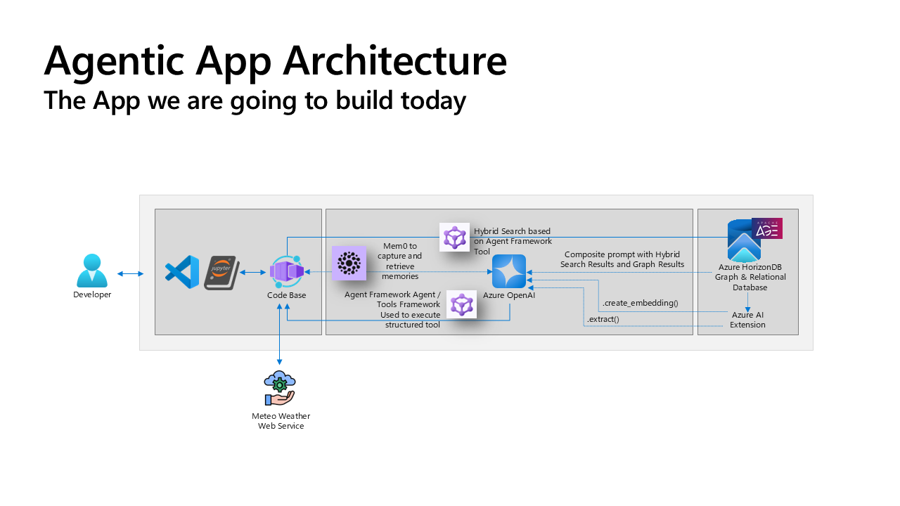
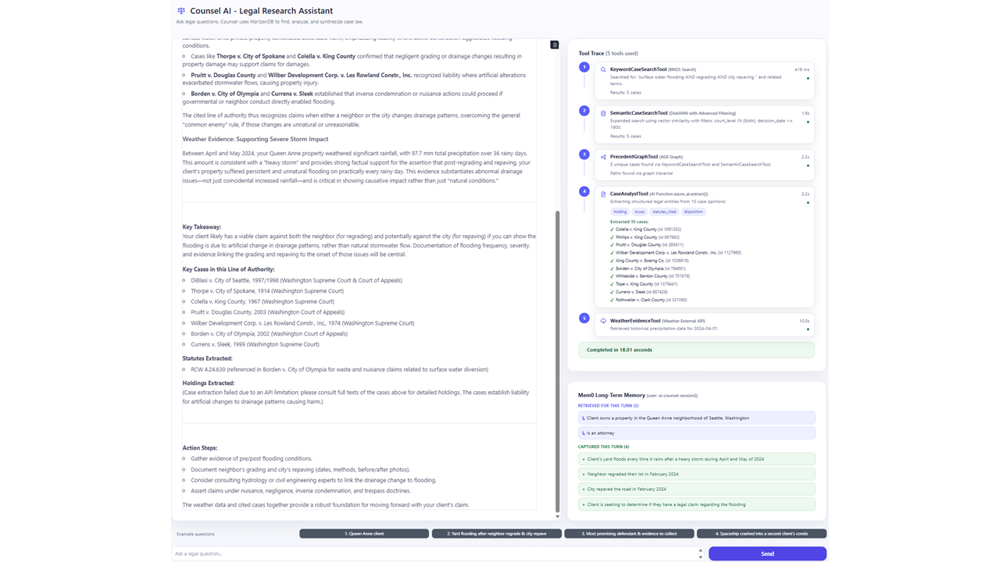

# LAB511: Create advanced Postgres-powered agentic apps with Azure HorizonDB

## Overview

This Microsoft Build 2026 lab walks you through building an **agentic legal research application** end to end, powered by a single **Azure HorizonDB** (Postgres) instance acting as your relational store, full-text search engine, vector database, graph database, **and** long-term memory store for the agent.

You will load a real U.S. case-law dataset, light up the AI extensions inside HorizonDB, and then assemble a Microsoft Agent Framework agent that combines **BM25 keyword search**, **vector similarity (DiskANN)**, **citation-graph traversal (Apache AGE)**, **in-database entity extraction (`azure_ai`)**, and an **external weather API** to write a real legal brief, with persistent memory across turns.

The lab is intentionally hands-on: every concept is paired with a runnable notebook cell, a Technical Background Notes block explaining what is happening underneath, and a short Tasks list telling you what to look at in the output.

## Architecture



## Application UI



## What You'll Build

- A **Microsoft Agent Framework** agent that can reason over U.S. case law stored in Azure HorizonDB.
- **Hybrid retrieval**: BM25 full-text search (`pg_fts`) combined with vector similarity search (`pgvector` + `pg_diskann` for ANN with advanced filtering).
- **GraphRAG** over a citation graph built with **Apache AGE**, letting the agent expand from anchor cases to surrounding precedents in a single Cypher-style traversal.
- **In-database entity extraction** with the `azure_ai` extension, so structured fields (`holding`, `issues`, `statutes_cited`, `disposition`) are pulled directly inside Postgres instead of round-tripping opinions back to the application.
- **External evidence ingestion** through a tool that calls the Open-Meteo weather archive API.
- **Long-term memory** with **Mem0**, where memory embeddings are stored back in the same HorizonDB instance using `pgvector`. No separate vector database.
- A **Gradio chat UI** that surfaces a live Tool Trace panel and the agent's growing memory store next to the conversation.

## Key Technologies

- **Azure HorizonDB**: managed Postgres with a rich AI extension surface (`vector`, `pg_diskann`, `pg_fts`, `azure_ai`, `age`).
- **Microsoft Agent Framework**: open-source SDK for building tool-using agents (`OpenAIChatClient`, `@tool` decorator, `client.as_agent(...)`).
- **Azure OpenAI**: GPT chat deployment for the agent and `text-embedding-3-small` (1536 dims) for case and memory embeddings.
- **Apache AGE**: property-graph engine inside Postgres for the citation graph (`(:case)-[:REF]->(:case)`).
- **Mem0**: long-term memory layer for agents, configured here against `pgvector` in HorizonDB.
- **Gradio**: web UI for the finished agent, embedded directly in the notebook.
- **Python**: notebooks driven by `psycopg`, `openai`, `agent-framework`, `mem0`, and `gradio`.

## Project Structure

```
├── LICENSE                       # MIT License
├── .env.sample                   # Sample environment variables for local runs
├── azure.yaml                    # azd project definition + hooks
├── requirements.txt              # Python package dependencies for the lab
├── README.md                     # This file
├── Code/
│   ├── 1-data-setup.ipynb        # Notebook 1: load cases, build indexes, build the graph
│   ├── 2-app-development.ipynb   # Notebook 2: build the 5-tool agent + Mem0 + Gradio UI
│   └── 3-diagnostics.ipynb       # Diagnostics / troubleshooting helpers
├── Dataset/
│   └── cases.csv                 # U.S. case law dataset used throughout the lab
├── Docs/                         # Lab documentation and architecture images
├── Infra/
│   ├── deploy.bicep              # Top-level Bicep template (full lab environment)
│   └── main.bicep                # azd entrypoint template + env-friendly outputs
└── Scripts/
  ├── azd/                      # Cross-platform azd post-provision hooks
  │   ├── postprovision.ps1     # Windows: builds the local .env file
  │   └── postprovision.sh      # macOS/Linux: builds the local .env file
  ├── Diagnostics/              # Optional troubleshooting SQL/scripts
    ├── show_graph.sql            # Sample SQL for inspecting the AGE citation graph
    └── Lab Internals/            # Scripts used to build and validate the lab VM image
```

## Prerequisites

- An **Azure subscription** with access to **Azure OpenAI** and **Azure HorizonDB**.
- **Visual Studio Code** with the **Jupyter** and **PostgreSQL** extensions installed.
- A **Python 3.11+** environment with the packages listed in [requirements.txt](requirements.txt):
  - Database connectivity: `psycopg[binary,pool]`
  - LLM and agent framework: `openai`, `agent-framework`
  - Long-term memory: `mem0`
  - Notebook compatibility: `jupyter`, `ipywidgets`, `nest_asyncio`
  - Data validation: `pydantic`
  - HTTP: `requests`
  - Environment management: `python-dotenv`
  - UI: `gradio`

> **Note for lab attendees:** the provided lab VM already has Python, every package in [requirements.txt](requirements.txt), and all VS Code extensions pre-installed. You can jump straight to the notebooks.

> **Working on this at home?** You will need to install the Python dependencies into your own environment. From the repo root:
>
> 1. Create a virtual environment:
>    - Windows (PowerShell): `python -m venv .venv` then `.\.venv\Scripts\Activate.ps1`
>    - macOS/Linux: `python3 -m venv .venv` then `source .venv/bin/activate`
> 1. Upgrade pip: `python -m pip install --upgrade pip`
> 1. Install the lab packages: `pip install -r requirements.txt`
> 1. In VS Code, select the `.venv` interpreter for the notebooks (Command Palette > **Python: Select Interpreter**).

## Lab Sections

The lab is delivered as two notebooks that build on each other.

### Notebook 1: Data Setup ([Code/1-data-setup.ipynb](Code/1-data-setup.ipynb))

1. **Connect to Azure HorizonDB** and enable the AI extensions (`vector`, `pg_diskann`, `pg_fts`, `age`, `azure_ai`).
1. **Load the case-law corpus** from [Dataset/cases.csv](Dataset/cases.csv) into a clean relational schema.
1. **Generate 1536-dim embeddings** for every opinion with Azure OpenAI and store them in a `vector(1536)` column.
1. **Build the retrieval indexes**: a BM25 index with `pg_fts`, and a DiskANN ANN index over the opinion vectors.
1. **Build the citation graph** with Apache AGE so each case becomes a `(:case)` node and every citation an edge.
1. **Register Azure OpenAI** with the `azure_ai` extension so later notebooks can call `azure_ai.extract(...)` directly from SQL.

By the end of Notebook 1 you have one Postgres database serving relational, vector, full-text, and graph queries with no separate stores.

### Notebook 2: Application Development ([Code/2-app-development.ipynb](Code/2-app-development.ipynb))

Each tool is introduced, smoke-tested by hand, and then handed to the agent so you can compare the raw output to the agent's narrative answer.

1. **Setup and configuration** (Part 3.1).
1. **Tool 1: `keyword_case_search`** (Part 3.2): BM25 full-text retrieval through `pg_fts`. Assemble your first single-tool agent.
1. **Tool 2: `semantic_case_search`** (Part 3.3): pgvector similarity search with DiskANN advanced filtering, then re-assemble the agent with two tools.
1. **Tool 3: `precedent_graph_search`** (Part 3.4): Cypher-style traversal of the AGE citation graph from BM25 + vector anchor cases. Re-assemble with three tools.
1. **Tool 4: `case_analyst_extract`** (Part 3.5): in-database extraction with `azure_ai.extract` to pull `holding`, `issues`, `statutes_cited`, `disposition` from full opinions. Re-assemble with four tools.
1. **Tool 5: `get_weather_evidence`** (Part 3.6): external evidence from Open-Meteo, used when a legal question turns on conditions like rainfall on a given date.
1. **Flagship run** (Part 3.7): all five tools registered together with a beefed-up system prompt, producing a real legal brief.
1. **Long-term memory with Mem0** (Part 3.8): wire Mem0 to pgvector in HorizonDB so the agent remembers client details and preferences across turns.
1. **Gradio web UI** (Part 3.9): wrap the full 5-tool + Mem0 agent in a Gradio chat app with a live Tool Trace panel and a Long-term Memory panel.
1. **Forced failover simulation** (Part 3.10): trigger a HorizonDB forced failover from the Azure portal while the Gradio app is running and watch the `_memory_search_with_retry` helper ride out the primary-to-standby promotion with no user-visible errors.

### Notebook 3: Diagnostics ([Code/3-diagnostics.ipynb](Code/3-diagnostics.ipynb))

Optional troubleshooting cells: verify connectivity, inspect extension state, re-check that embeddings, indexes, and the AGE graph are all in place.

## Getting Started

1. Open [Code/1-data-setup.ipynb](Code/1-data-setup.ipynb) in VS Code and work through every cell top to bottom. Each cell pairs a `🧠 Technical Background Notes` block with a `📝 Tasks` checklist so you always know what to look at.
1. Once Notebook 1 finishes successfully, open [Code/2-app-development.ipynb](Code/2-app-development.ipynb) and do the same.
1. In Part 3.9, running the final cell launches the Gradio UI on [http://localhost:7860](http://localhost:7860). Open it in a browser and chat with your finished agent.

## AZD Deployment Option

If you want to work on this lab at home, this repo includes an `azd`-based deployment option so you can quickly provision the required resources in your own Azure subscription.

- `azure.yaml` points `azd` to [Infra/main.bicep](Infra/main.bicep), which wraps the existing template and exposes deployment outputs as environment-friendly names.
- A cross-platform post-provision hook runs automatically after `azd provision` and builds a local `.env` file in the repo root from the Bicep outputs plus an Azure OpenAI key lookup:
  - Windows: [Scripts/azd/postprovision.ps1](Scripts/azd/postprovision.ps1)
  - macOS/Linux: [Scripts/azd/postprovision.sh](Scripts/azd/postprovision.sh)

The `.env` file is what the notebooks read for HorizonDB and Azure OpenAI connection details, so you do not need to copy values around by hand.

> **Important: allow your IP on HorizonDB.** The post-provision hook does not configure HorizonDB networking. Before you can connect from your machine, open the deployed HorizonDB cluster in the Azure portal, go to **Settings > Networking**, and add a firewall rule that allow-lists your current public IP address. Without this step, notebook connections will fail with a network/timeout error.

### One-Time Prerequisites

1. Install Azure CLI and `azd`.
1. Sign in:
  - `az login`
  - `azd auth login`

### Deploy With AZD

1. Initialize an environment name:
  - `azd env new <environment-name>`
1. Provision infrastructure and run post-provision hooks:
  - `azd provision`

After provisioning completes, your repo root `.env` is created/updated and is ready for notebooks.

## Additional Resources

- [Azure HorizonDB documentation](https://aka.ms/horizondb)
- [GraphRAG solution for Azure Database for PostgreSQL](https://aka.ms/pg-graphrag)
- [Graph data in Azure Database for PostgreSQL](https://aka.ms/age-blog)
- [PostgreSQL extension for Visual Studio Code](https://marketplace.visualstudio.com/items?itemName=ms-ossdata.vscode-postgresql)
- [Microsoft Agent Framework documentation](https://microsoft.github.io/agent-framework/)
- [Mem0 documentation](https://docs.mem0.ai/)

## License

This project is licensed under the MIT License. See the [LICENSE](LICENSE) file for details.
